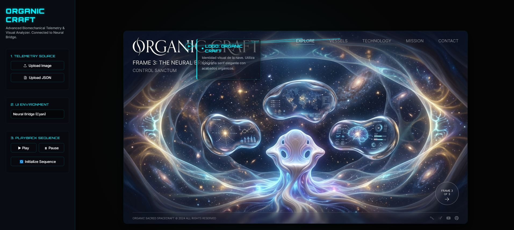

<div align="center">
  
  
  
  
</div>

<br>

<div align="center">
  <h1>🌌 Organic Craft: The Neural Bridge</h1>
  <p><strong>A Premium, Dynamic, and Immersive Telemetry Visualizer</strong></p>
</div>


---

## 🚀 Overview

**Organic Craft - The Neural Bridge** is a high-tier, interactive image marker and data visualization tool. Designed with cutting-edge UI/UX principles, it instantly transforms static images and telemetry data (JSON) into a breathtaking cinematic experience driven by **GSAP** (GreenSock Animation Platform) and modern **Glassmorphism**.

The application operates as a standalone web experience. It automatically attempts to sync with local telemetry (`organic_craft.json`) and visuals (`organic_craft_frame_3_the_neural_bridge.png`) upon launch, removing friction and delivering an immediate "wow" factor.

---

## ✨ Premium Features

- 🎭 **Cinematic GSAP Animations**: Smooth, staggering, and elastic intro sequencing that brings data points to life. Hover interactions trigger organic macro-animations. 
- 🪞 **Glassmorphism UI**: Beautiful frosted-glass sidebar panels (`backdrop-filter`) that adapt dynamically to underlying content.
- 🎨 **Multi-Environment Themes**: Seamless toggle between four distinct UI core modes built with deeply integrated CSS Variables:
  - 🔵 **Neural Bridge (Default)**: Cyan/Deep Blue neon aesthetics.
  - 🔴 **Bio-Hazard**: Aggressive crimson and warning elements.
  - 🟢 **Void Matrix**: Monospace hacker-terminal aesthetic.
  - ⚪ **Quantum Core**: Ultra-premium monochrome and sleek design.
- ⚡ **Zero Friction Auto-Load**: The application utilizes standard modern Browser Fetch APIs to instantly mount the initial `.json` and `.png` models.
- 📁 **Manual Override**: Sleek custom file upload controls allow for uploading any new image and mapping file on the fly.

---
## ⚡ Support
<div align="center">

**Made with ❤️ and ☕ by the Plantacerium**

[](https://ko-fi.com/plantacerium)

⭐**Star us on GitHub**⭐
</div>

## 🛠️ Installation & Usage

Because the application fetches local files (`organic_craft.json`) automatically, opening `index.html` directly in your browser (`file:///...`) might trigger strict **CORS (Cross-Origin Resource Sharing)** protocols depending on your browser.

To run the application with full functionality, serve it via a lightweight local server.

### Option A: Node.js (Recommended)
If you have Node.js installed, open your terminal in the project directory and run:
```bash
npx serve .
```
Open the provided `http://localhost:3000` link in your browser.

### Option B: Python
If you have Python installed, open your terminal and run:
```bash
python -m http.server 8000
```
Open `http://localhost:8000` in your browser.

*(If you don't run a server, the auto-fetch will fail elegantly, and you can still manually upload the `organic_craft_frame_3_the_neural_bridge.png` and `organic_craft.json` using the side-panel controls.)*

---

## 📐 Data Architecture (Extended JSON Schema)

Want to map your own image? The application expects a JSON file with the following powerful structure.

### Base Component Link (Minimal Schema)
This is the required core structure to plot standard markers onto an image:

```json
{
    "scene_name": "Organic Craft - The Neural Bridge",
    "markers": [
        {
            "id": "m1",
            "x": 19,
            "y": 8,
            "label": "Logo: Organic Craft",
            "description": "Visual identity of the vessel.",
            "duration": 2 
        }
    ]
}
```

### Premium Features (Extended Schema Example)
The architecture supports advanced rendering and cinematic triggers using properties like `category`, `connects_to`, `zoom`, and `data_points`.

```json
{
    "scene_name": "Organic Node",
    "markers": [
        {
            "id": "m1",
            "x": 19,
            "y": 8,
            "label": "Core Processor",
            "description": "Main logic unit.",
            "duration": 2.5,
            "category": "critical",
            "zoom": 1.5,
            "connects_to": ["m2", "m3"],
            "data_points": [
                {"label": "Temp", "value": "90C", "status": "warning"},
                {"label": "Load", "value": "99%", "status": "critical"}
            ]
        }
    ]
}
```

### Schema Breakdown:
- `scene_name`: (String) General title for the dataset.
- `markers`: (Array) The collection of points.
  - `id`: (String) Unique identifier (required for `connects_to` targets).
  - `x`: (Number) X coordinate percentage (0 to 100) from Left.
  - `y`: (Number) Y coordinate percentage (0 to 100) from Top.
  - `label`: (String) Display title mapping to the marker.
  - `description`: (String) Secondary detailed data text.
  - `duration`: (Number) Time (in seconds) the automated sequence will pause here.
  
#### 🔥 Premium Phase 2 Properties:
  - `category`: (String) Colors the marker dynamically. Accepts `system`, `critical`, `environment`, `power`, or `navigation`.
  - `zoom`: (Number) Automatically pans and zooms the camera (e.g. `1.5` for 150%) to this coordinate when active.
  - `connects_to`: (Array of Strings) Draws animated glowing neural lines to the listed `id`s.
  - `data_points`: (Array of Objects) Creates a sleek telemetry terminal grid inside the info card. Each object requires `label`, `value`, and `status` (`optimal`, `stable`, `warning`, `critical`).

---

> *"The mind and the machine. Connected across the Void."*
